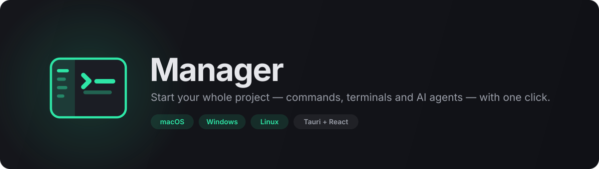
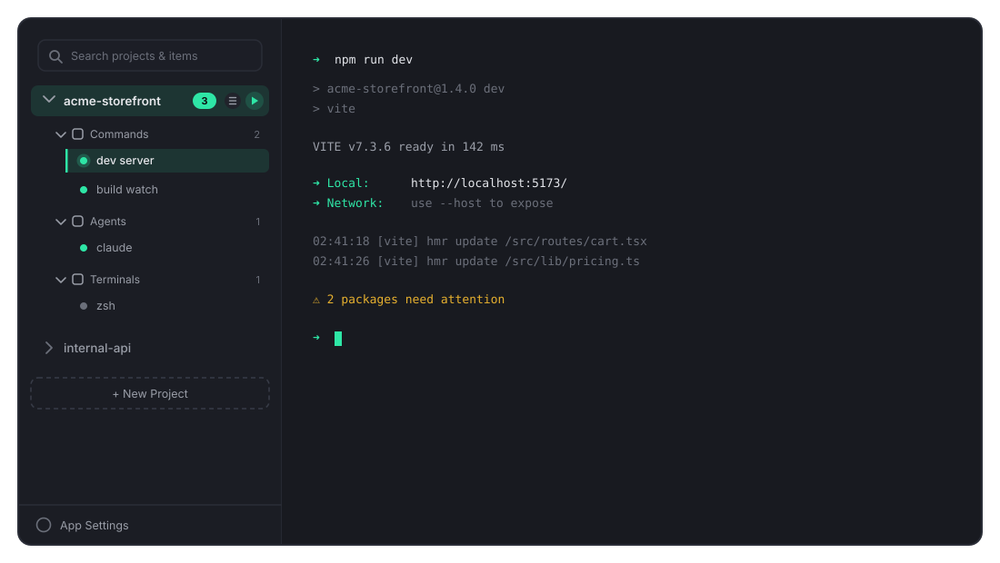

<p align="center">
  
</p>

<p align="center">
  
  
  
  
  
</p>

---

## What is Manager?

**Manager** is a cross-platform desktop app that starts your entire development environment with a single click.

Every project you work on has the same morning ritual: open a terminal, `cd` into the repo, start the dev server. Open another tab, start the build watcher. Another for the API. One more to run your AI coding agent. Repeat for every project, every day.

Manager collapses that into one button. You define a project's **commands**, **terminals**, and **AI agents** once — each with its own working directory and environment — then hit **Start**. Every process spawns in its own real PTY, streams live into a proper terminal emulator, and keeps running in the background (with a menu-bar icon showing how many are alive) until you stop it.

It's a *project* manager, not just a terminal: the sidebar is organised around what you're working on, not around anonymous shell tabs.

<p align="center">
  
</p>

<p align="center"><sub>The Manager window — projects and their groups on the left, the live session on the right.</sub></p>

---

## Features

### One-click project startup
- Define **Commands** (`npm run dev`), **Terminals** (a plain shell), and **AI Agents** (`claude`, `codex`, or any CLI) per project.
- **Start** spawns every item marked *auto-start* at once, each in its own PTY.
- Per-item working directory and environment variables, defaulting to the project root.
- **Stop All** tears a whole project down; individual items can be started, stopped, and restarted independently.

### Real terminals, not log tails
- Full terminal emulation via **xterm.js** over genuine PTYs — interactive prompts, colours, cursor addressing, and TUIs all work.
- Sessions survive navigation: switching projects or items only changes what's visible, never kills a running process.
- Live resize propagated to the PTY, configurable scrollback, and exit codes reported inline.

### Organised sidebar
- Projects expand into three groups — Commands, Agents, Terminals — with a running-count badge per project.
- Status dots per item: idle, running, exited.
- The active session is highlighted in the sidebar itself with an accent bar — no separate tab strip stealing vertical space.
- Right-click any item for **Start/Stop**, **Edit** (jumps straight to that item in project settings), or **Delete**.
- Search filters projects *and* their items.

### Import what you already have
- Point Manager at a project directory and it detects **`package.json` scripts** (picking `npm`/`yarn`/`pnpm` from your lockfile) and **Makefile targets**.
- Pick the ones you want from a checklist; they become Commands instantly.

### Runs in the background
- **System tray icon** with a live tooltip (`3 sessions running`), plus Show / Stop All / Quit.
- Closing the window **hides** it — your processes keep running and the tray brings you back.
- Quitting with live sessions asks for confirmation first, so a stray <kbd>Cmd</kbd>+<kbd>Q</kbd> never silently kills a long build.

### Configurable
- **Theme**: dark, light, or follow the system.
- **Default shell** picked from the shells actually installed on your machine.
- **Terminal appearance**: font family, font size, scrollback depth.
- Optional confirmation before destructive actions.

### Backup and share setups
- **Export** a single project or all of them to a JSON file.
- **Import** adds projects from a file — it never overwrites what's already there.
- Handy for moving machines, backing up, or sharing a team's standard environment.

### Built to be debuggable
- File-based logging (Rust *and* frontend) so a bug report can include real evidence instead of "it went blank".
- A React error boundary catches render crashes and logs them rather than leaving a white window.

---

## Keyboard shortcuts

| Shortcut | Action |
| --- | --- |
| <kbd>Cmd/Ctrl</kbd> + <kbd>Shift</kbd> + <kbd>T</kbd> | New terminal in the active project |
| <kbd>Cmd/Ctrl</kbd> + <kbd>Shift</kbd> + <kbd>W</kbd> | Close the active session |
| <kbd>Cmd/Ctrl</kbd> + <kbd>1</kbd>–<kbd>9</kbd> | Jump to the *n*-th project |

> Tab actions deliberately use <kbd>Shift</kbd>. Plain <kbd>Ctrl</kbd>+<kbd>T</kbd> and <kbd>Ctrl</kbd>+<kbd>W</kbd> are real shell bindings (transpose-chars, delete-word-backward) and would otherwise be swallowed before reaching your shell.

---

## Technology

| Layer | Choice | Why |
| --- | --- | --- |
| Shell / runtime | **[Tauri 2](https://tauri.app)** (Rust) | Native binaries measured in single-digit MB, system WebView instead of a bundled Chromium. |
| PTY | **[`portable-pty`](https://crates.io/crates/portable-pty)** | WezTerm's own crate — one API across `openpty` on macOS/Linux and ConPTY on Windows. |
| UI | **React 19** + **TypeScript** | Strict mode, with `noUnusedLocals` / `noUnusedParameters` enabled. |
| Terminal | **[xterm.js 5](https://xtermjs.org)** + `addon-fit` | The emulator behind VS Code's integrated terminal. |
| State | **[Zustand 5](https://zustand-demo.pmnd.rs)** | One small store; config CRUD with debounced autosave. |
| Build | **Vite 7** | Sub-second HMR during development. |
| Icons | **[lucide-react](https://lucide.dev)** | Thin, consistent stroke icons. |
| Styling | Plain CSS with custom properties | Design tokens in one file; dark/light with no runtime cost. |
| Plugins | `tauri-plugin-dialog`, `-log`, `-opener` | Native file pickers and file-based logging. |

### How output reaches the screen

PTY reads block, so each session owns a dedicated OS thread that reads into an 8 KB buffer and emits base64 chunks on a per-session Tauri event (`pty://output/{id}`). A second thread blocks on `child.wait()` and emits `pty://exit/{id}` with the exit code. Session state lives in a `std::sync::Mutex<HashMap<..>>` — every command holds the lock only for a short synchronous critical section, never across an `await`.

Spawning is deliberately two-phase: `spawn_session` returns an id, the frontend attaches its listeners, *then* calls `start_reading`. Without that handshake, a fast-starting program can emit its first output before anyone is listening.

---

## Installing

### Download

Grab the latest build from the [Releases](../../releases) page.

- **macOS** — `Manager_x.y.z_macos.dmg`. Open it and drag *Manager* to Applications.
- **Windows** — `Manager_x.y.z_windows_portable.zip`. Unzip anywhere and run `Manager.exe`.

> **On unsigned builds:** these binaries aren't code-signed yet, so macOS Gatekeeper and Windows SmartScreen will warn on first launch. On macOS, right-click the app → **Open** to get past it once. Signing and notarisation are on the roadmap.
>
> **On the Windows build:** it's currently a portable app rather than a `setup.exe` (no Start Menu entry or uninstaller). The `.exe` itself is a fully native Windows binary; only the installer wrapper is missing, because NSIS's macOS build crashes while embedding Tauri's installer plugin. Building on a real Windows runner produces a proper installer — see the roadmap.

### Build from source

Requires **Node 18+** and a **stable Rust toolchain** ([rustup](https://rustup.rs)), plus your platform's Tauri [prerequisites](https://tauri.app/start/prerequisites/).

```bash
git clone https://github.com/muhammadZihad/manager.git
cd manager
npm install
npm run tauri dev
```

To produce a release bundle for your current platform:

```bash
npm run tauri build
```

Linux (AppImage / deb) builds from source but isn't covered by CI yet — reports welcome.

---

## Getting started

1. Click **New Project**, give it a name, and browse to its directory.
2. Open the project's **settings** (gear icon) and add items:
   - a **Command** like `npm run dev`
   - an **Agent** like `claude`
   - a **Terminal** (leave the command blank for your default shell)

   Or hit **Import…** in the Commands section to pull in your existing `package.json` scripts.
3. Mark the items you want in the one-click startup as **auto-start**.
4. Press ▶ on the project header. Everything spawns at once.

---

## Project structure

```
manager/
├── assets/                   # Logo, banner, interface illustration
├── src/                      # React frontend
│   ├── components/           # Sidebar, Terminal, TerminalGrid, settings views…
│   ├── hooks/                # useKeyboardShortcuts
│   ├── lib/                  # Typed wrappers over Tauri commands & events
│   ├── styles/theme.css      # Design tokens + component styles
│   ├── store.ts              # Zustand store (config CRUD + live session registry)
│   └── types.ts              # Project / Runnable / Agent / AppSettings
└── src-tauri/
    └── src/
        ├── pty.rs            # PTY sessions, reader & reaper threads
        ├── config.rs         # projects.json load/save
        ├── shell.rs          # Installed-shell detection
        ├── import.rs         # package.json / Makefile script detection
        ├── transfer.rs       # Project export/import
        ├── tray.rs           # Tray icon, menu, running-count tooltip
        └── lib.rs            # Builder, commands, window & exit handling
```

---

## Development

```bash
npm run tauri dev        # Run the app with HMR (Rust changes trigger a rebuild)
npm run build            # Type-check + build the frontend
npx tsc --noEmit         # Type-check only
cd src-tauri && cargo check   # Type-check the Rust side
```

Frontend edits hot-reload instantly. Editing anything under `src-tauri/` rebuilds and restarts the app automatically.

---

## License

[MIT](LICENSE)
